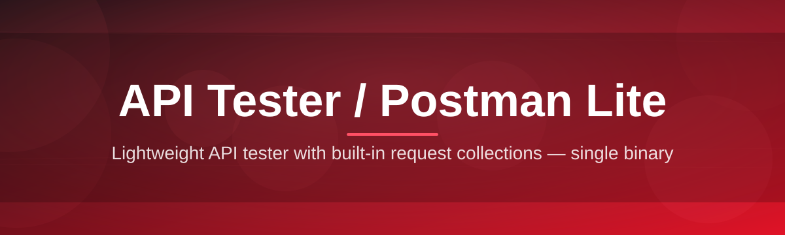
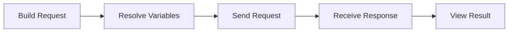

# api-test-suite 🚀🧪

  

*A featherweight API workbench that fires requests, reads responses, and gets out of your way — built for the 90% of API testing that doesn't need a browser tab army.*

  

<strong>📖 The origin story — why I built yet another API client</strong>

 

I didn't set out to build a "Postman alternative." I set out to stop waiting eight seconds for a Postman splash screen just to check if a `/health` endpoint returned `200`.

Somewhere along the way, the tool I reached for daily turned into a full desktop suite with sync accounts, workspace invites, and a changelog longer than some backend services I test with it. I wanted something that opens instantly, remembers my last three environments, and never asks me to sign in to send a `GET` request.

So over a few very caffeinated weekends, **api-test-suite** was born. It started as a single-window request runner. It's now a genuinely capable API tester with collections, environments, scripting hooks, and a response viewer I'm honestly proud of. It's still just one `.exe`. No installer wizard, no background service, no telemetry ping on launch — just a tool that respects that you have somewhere else to be.

This README is the whole story: what it does, how it's built, and how to get it running in under a minute.

---

## 🧭 Overview

**api-test-suite** is a native Windows application for building, sending, and inspecting HTTP requests — the same job Postman does, minus the ceremony. Think of it as a scalpel where the big commercial tools became a whole surgical robot: precise, fast, and built for the actual task of *API testing* rather than team collaboration dashboards you'll open twice a year.

It exists because API testing shouldn't require an account, a workspace, or a browser engine running in the background just to render a JSON tree. Whether you're a backend developer sanity-checking an endpoint mid-deploy, a QA engineer scripting a smoke-test pass before release, or a student poking at a public REST API for the first time, this tool gives you the request/response loop — collections, environments, headers, auth, scripting — without the overhead. It's an **API tester** in the truest sense: type a URL, pick a method, hit send, read the response.

Under the hood it's a **Postman Lite** by design philosophy, not by feature subtraction alone — every feature that made it in earns its place by being something people actually reach for daily: variables, saved collections, response diffing, and a request history that doesn't vanish when you close the window. If you've ever thought "I just need to test one endpoint, why is this taking six clicks and a login screen," this is the tool built specifically for that moment.

---

## ⚡ What It Actually Does

> [!TIP]
> Every capability below was built because I personally hit the wall it solves — none of this is speculative "wouldn't it be nice" feature bloat.

- **Instant request firing** — build a `GET`, `POST`, `PUT`, `PATCH`, or `DELETE` call in seconds, with method-aware body editors that don't make you fight the UI to send a form-encoded payload.

- **Environment variables that actually stay out of your way** — swap between `dev`, `staging`, and `prod` with one dropdown, and watch `{{baseUrl}}` resolve live as you type the request URL.

- **Collections that read like a folder tree, not a database** — group related requests, reorder them by drag, and export a whole collection as a single portable file.

- **A response viewer built for humans** — syntax-highlighted JSON/XML, collapsible tree nodes, response time and payload size front and center, and a raw view one click away.

- **Pre-request and post-response scripting hooks** — lightweight JavaScript snippets to set headers dynamically, chain tokens between requests, or assert on a response field before you even look at it.

- **Auth made boring (in the best way)** — Bearer tokens, Basic auth, API keys, and OAuth2 flows, all stored per-environment so you're never pasting a token into three different tabs.

- **Request history with actual memory** — every call you've sent this session (and last session) is one click away, timestamped and searchable.

- **Import from cURL and OpenAPI/Swagger** — paste a cURL command or point it at a spec file and get a ready-to-edit request without retyping headers by hand.

> [!NOTE]
> None of the above phones home. Requests go from your machine to the API you're testing — full stop.

---

## 🚀 How To Get Started

<strong>Step-by-step: from zero to your first request in under a minute</strong>

 

1. **Visit the landing page.** Click the download button below — it takes you straight to the project's official page, no redirects through third-party mirrors.

2. **Download the Windows build.** It's a single standalone executable. No installer, no wizard, no "choose your components" screen.

3. **Run it.** Double-click. Windows SmartScreen may flag it as unrecognized on first launch since it's not code-signed by a large publisher yet — click *More info → Run anyway*.

4. **Send your first request.** Paste a URL, pick `GET`, hit the send button (or `Ctrl+Enter`). Watch the response land in under a second for most APIs.

That's it. No account creation, no email verification, no fifteen-tab onboarding tour.

---

## 🖥️ System Requirements

  

| Requirement | Detail |
|---|---|
| **OS** | Windows 10 (64-bit) or Windows 11 |
| **Dependencies** | None — fully standalone, no runtime to install separately |
| **Disk space** | Well under 100 MB |
| **RAM** | Comfortable on 4 GB systems; flies on anything more |
| **Network** | Only needed for the requests *you* send — the app itself makes no external calls on its own |

> [!IMPORTANT]
> This is a Windows-native build. There's no macOS or Linux binary right now — it's on the radar, but Windows came first because that's the platform I test APIs on daily.

---

## 🔧 How It Works

The architecture is deliberately boring, in the best engineering sense of the word — boring things don't crash at 2am.

1. **You compose a request** in the builder — method, URL, headers, body, auth.
2. **Variables resolve** — any `{{variable}}` in the URL, headers, or body gets substituted from the active environment.
3. **Pre-request scripts run**, if attached — this is where tokens get refreshed or timestamps get injected.
4. **The request fires** over the network using the standard HTTP stack, and the raw response comes back.
5. **Post-response scripts and the viewer take over** — parsing, formatting, and any assertions you've defined light up green or red.

> [!TIP]
> Chaining requests? Use post-response scripts to stash a token into an environment variable, then reference it as `{{authToken}}` in the very next request. That's the whole trick behind testing multi-step auth flows.

---

## 🛠️ Troubleshooting

<strong>My request hangs and never returns a response — what's going on?</strong>

 

Most often this is a timeout against an endpoint that's slow, sleeping, or blocked by a firewall/VPN rule. Check the request timeout setting first, then verify the same URL responds from a browser or terminal on the same network.

<strong>Windows SmartScreen is blocking the app from opening.</strong>

 

This happens with new, not-yet-widely-flagged executables. Click **More info**, then **Run anyway**. As download counts grow, this warning naturally fades — it's a reputation heuristic, not a verdict on the file itself.

<strong>My environment variables aren't resolving in the request.</strong>

 

Double-check you've *selected* the environment in the dropdown — having variables defined isn't the same as having that environment active. Also confirm the variable name matches exactly, including case.

<strong>Can I test GraphQL endpoints, or is this REST-only?</strong>

 

GraphQL works fine — it's just a `POST` with a JSON body containing a `query` field. There's no dedicated GraphQL mode yet, but nothing stops you from testing it today.

<strong>My imported cURL command didn't bring over all the headers.</strong>

 

The parser handles standard `-H`, `-d`, and `-X` flags well, but heavily shell-escaped commands (nested quotes, multi-line backslashes) can trip it up. Try flattening the command to a single line before pasting.

<strong>Does this support WebSocket testing?</strong>

 

Not yet — it's firmly on the roadmap, but the current focus is making standard HTTP request/response testing as sharp as possible first.

---

## 🎨 UI / UX Details

> [!NOTE]
> The interface is built to disappear once you know it — every shortcut below exists so your hands never leave the keyboard mid-test.

**Keyboard shortcuts**

| Action | Shortcut |
|---|---|
| Send request | `Ctrl + Enter` |
| New request tab | `Ctrl + T` |
| Close current tab | `Ctrl + W` |
| Save request | `Ctrl + S` |
| Switch environment | `Ctrl + E` |
| Toggle response formatting | `Ctrl + Shift + F` |

**Themes** — Light, Dark, and a high-contrast mode for anyone squinting at JSON trees at 1am.

**Settings that matter:**

- Default request timeout (configurable per environment)
- Auto-format response toggle (JSON/XML pretty-printing on or off)
- Font size for the response viewer, independent of the rest of the UI
- History retention window — keep forever, or auto-clear after N days

---

## 🤝 Contributing & Community

This is a passion project, but it's not a solo island — issues, feature requests, and pull requests are genuinely welcome.

> [!TIP]
> Before opening a feature request, check existing issues — there's a good chance someone's already asked, and a thumbs-up on an existing thread carries real weight when